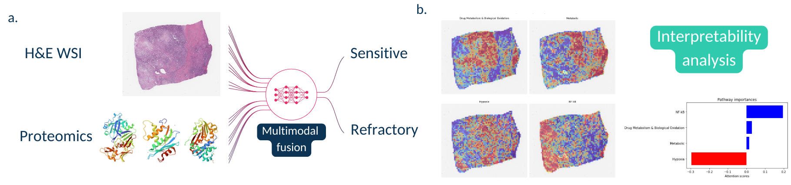

# Multimodal High-Grade Serous Ovarian Cancer platinum response prediction

##### Oz Kilim, Alex Olar, András Biricz, Péter Pollner, Zsofia Sztupinszki, Zoltán Szállási, István Csabai



#### This repo contains full code for:

1. Pre-processing and all experiments for the paper: "Histo-proteo multimodal deep learning for High-Grade Serous Ovarian Cancer platinum response prediction"
2. SSL of large scale opensource Ovarian Histopathology WSIs.

## 1. Download, data cleaning cleaning and creation of splits.

```python3 HGSOC_platinum_responce/HGSOC_TCGA_tasks_data_setup.py```

## 2. Running classical Proteomics only models.

```python3 HGSOC_platinum_responce/classical_models_omics.py```

## 3. Running WSI and Multimodal models.

```TCGA_train_HGSOC_test.sh```

## 4. Plotting results.

```notebooks/results_analysis/TCGA_HGSOC_results.ipynb```

## 5. Heatmap generation. 

```./heatmap.sh```

```notebooks/interpretability/vis_multi_heatmaps.ipynb```

# 6. Self supervised learning pre-training

## Collated data for SSL

| Dataset | Num WSIs | Micron per pixel | data type | Link |
|----------|----------|----------|----------|----------|
| TCGA_OV | 1481 | 0.5040 | .svs | Row 1, Col 5 |
| CPTAC_OV | 221 | 0.2501 | .svs | Row 2, Col 5 |
| HGSC | 349 | 0.4965 | .svs | Row 3, Col 5 |
| Ovarian Bevacizumab Response | 284 | 0.5 (20X) | .tif | Row 4, Col 5 |
| UBC OCEAN | 538 | 0.5 | .png | Row 5, Col 5 |
| Internal | 42 | 0.424 | .mrxs | Row 6, Col 5 |

### Generate h5 files for all ovarian slides avalalble at correct magnifications. 

```./bulk_ovarian_patching.sh```

